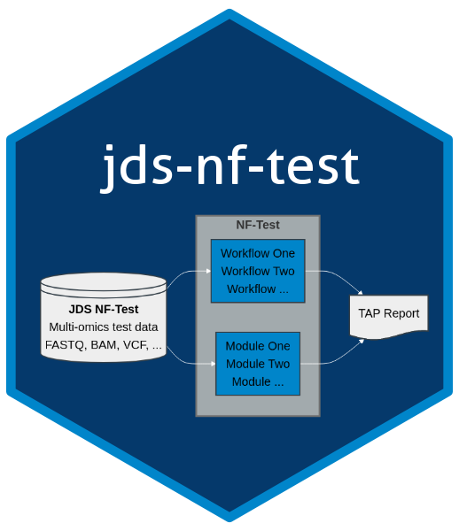

# jds-nf-test  

Repository for hosting test data for jds-nf-workflows

## Data Sources

This repository contains simulated and subset data for various data types to be used in conjunction with the [`nf-test`](https://www.nf-test.com/) framework as part of the [`jds-nf-workflows`](https://github.com/TheJacksonLaboratory/jds-nf-workflows) Nextflow workflows.  

Data are for __testing purposes__ only, and are provided under MIT licensing as such.  
